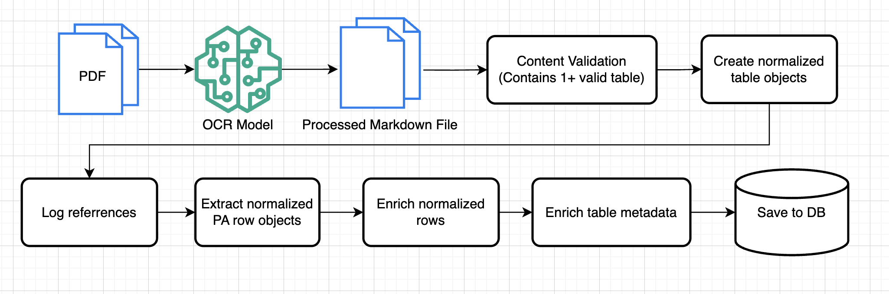

# LLM-Powered Structured Data Extraction Pipeline for Spectroscopy Literature

*Built in collaboration with the UGA Department of Physics & Astronomy*

---

## Introduction

### The Problem
Raman and infrared spectroscopy papers report peak-assignment data — the frequency and mode-assignment tables spectroscopists rely on — with **no standardized reporting format**. Different papers use different notation conventions (Mulliken, Herzberg, Wilson), inconsistent table structures, and metadata buried in prose rather than clean fields. Manually transcribing decades of this literature into a usable, structurally consistent dataset is slow, error-prone, and doesn't scale to building a literature-wide spectroscopy database.

Any real solution needs to:
- Handle **heterogeneous formatting** across papers written decades apart, by different research groups, using different notation traditions
- Produce **structurally consistent, normalized output** rather than one-off, ad hoc transcriptions
- Keep a **human in the loop** for verification, rather than blindly trusting fully automated extraction

### The Solution
**SpectraGuru** is a multi-stage pipeline that takes a scientific PDF and turns it into a normalized, structured dataset. It reads the paper, figures out which tables actually contain peak-assignment data, pulls out each individual peak measurement, and enriches every row with standardized chemistry and vibrational-mode metadata — all validated against a rigorously designed data schema built in collaboration with the SpectraGuru research team. The result is a growing, literature-wide dataset that's consistent enough to analyze at scale, and detailed enough to eventually serve as training or benchmark data for downstream machine learning work (e.g., predicting molecular structure from a spectrum).

---

## Architecture

### Diagram

### Architecture Breakdown & Design Choices

| Layer | Choice | Why |
|---|---|---|
| **OCR / PDF ingestion** | Datalab/Marker hosted OCR API | Offloads a genuinely hard problem — robust PDF table-structure extraction — to a specialized external service rather than reinventing PDF parsing |
| **Extraction engine** | Google Gemini (`gemini-3-flash-preview`) | Chosen for strong structured-output support and multimodal PDF understanding |
| **Output constraints** | Pydantic v2 models (`extra="forbid"`) passed as JSON Schema to the LLM's structured-output API | Correct, idiomatic use of schema-constrained generation — the model can only emit outputs matching the defined schema, rather than relying on prompt instructions and free-text JSON scraping |
| **Verification strategy** | Two-pass self-consistency check between the content-validation stage and the table-isolation stage | A lightweight, prompt-level technique for reducing output variance — the model is asked to cross-validate its own answer against its own prior output rather than trusting a single pass |
| **Persistence (current)** | Checkpointed flat JSON files after every stage | Makes each stage idempotent and resumable — a failure late in a long document doesn't waste the cost and latency of earlier LLM calls |
| **Data model** | A 79-parameter normalization schema spanning provenance, instrument/acquisition parameters, analyte chemistry (SMILES, CAS numbers), and vibrational-mode taxonomy | Real domain modeling, developed and iterated with a research collaborator — this is the project's deepest and most differentiated asset |

**Data flow:** PDF → OCR'd markdown → LLM-validated candidate tables → cross-checked Raman-specific subset → extracted peak rows (strict schema validation) → enriched vibrational-mode metadata (+ parallel reference-list extraction) → checkpointed JSON.

**A note on scope:** this is a research-infrastructure tool for a single research group's literature-review workflow, not a consumer product — the architecture is intentionally linear and single-document at this stage, rather than over-built with infrastructure the current scale doesn't need.

### Key Components & Quantitative Results

| Component | Notes |
|---|---|
| PDF → Markdown OCR (Datalab/Marker) | Handles table-structure-preserving conversion |
| Content validation (candidate table detection) | Schema-constrained Gemini call |
| Table isolation + self-consistency cross-check | Two-pass verification between stages |
| Row extraction (`PeakRow` schema) | Strict Pydantic validation, `extra="forbid"` |
| Vibrational mode enrichment | 10+ normalized fields per row (notation, symmetry, SMILES, etc.) |
| Reference log extraction | Runs alongside row extraction |
| 79-parameter domain schema | Designed and iterated with a research collaborator |
| Hand-labeled gold-standard dataset | Built as ground truth for evaluation |

> **Note on metrics:** the pipeline includes a hand-built gold-standard evaluation dataset, but it is not yet wired into an automated scoring script. Field-level extraction accuracy, per-stage latency, and token cost are being actively measured and will be added here once the evaluation harness is complete.
